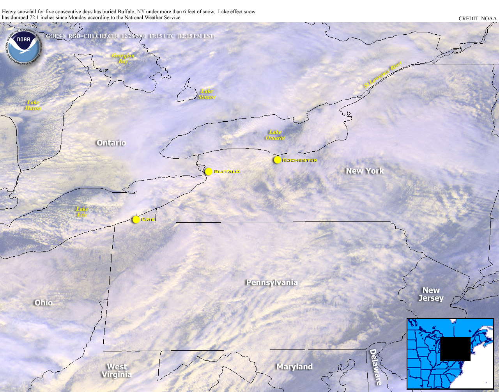

The original dataset was pulled from the NOAA (National Oceanic and Atmospheric Association) National Climatic Data Center, http://doi.org/10.7289/V5D21VHZ, on August 15, 2017. 

The full dataset can be downloaded from the website above, where information is collected from over 100,000 stations in 180 countries and territories on a daily basis. Routine checks are performed to ensure that values continue to be recorded. 

For our analysis, we only took observations from New York State weather stations for the years 2000-2010. There are five measures that each of these stations can record: prcp, snow, snwd, tmax and tmin. Prcp is the variable for total precipitation measured for each day in tenths of millimeters. Snow and snwd are the measurements of snowfall and snowdepth respectivley, both recorded in millimeters. Tmax and tmin are the maximum and minimum temperatures recorded for each day, noted in the scale of tenths of degrees Celsius. For each series of measurements there is a station ID and a date stamp given. 

